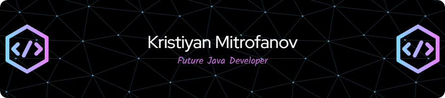

<h1 align="center">Hi 👋, I'm Kristiyan Mitrofanov</h1>
<h3 align="center">A hardworking and ambitious programmer, who loves spending time coding, reading techincal books, working out and playing video games.</h3>

  

  

- 🔭 I’m currently working on [FitnessDoc](https://github.com/KristiyanMitrofanov/FitnessDoc) & [FitnessDocUI](https://github.com/KristiyanMitrofanov/FitnessDocUI)

- 🌱 I’m currently learning **Spring** & **React.js**

- 📫 How to reach me **kristiyanmitrofanov@gmail.com**

<h3 align="left">Connect with me:</h3>

<h3 align="left">Languages and Tools:</h3>

           

&nbsp;

