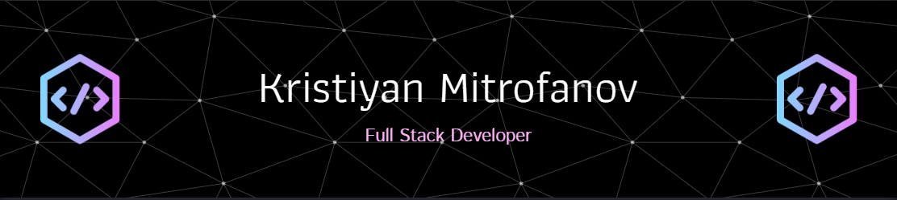

<h1 align="center">Hi 👋, I'm Kristiyan Mitrofanov</h1>
<h3 align="center">A hardworking and ambitious programmer, who loves spending time coding, reading techincal books, working out and playing video games.</h3>

  

  

- 🔭 I’m currently working in [DevExperts](https://devexperts.com/)

- 🌱 I’m currently learning **Spring** & **React.js**

- 📫 How to reach me **kristiyanmitrofanov@gmail.com**

<h3 align="left">Connect with me:</h3>

  

<h3 align="left">Languages and Tools:</h3>

              

   

 

<h3>Technical Books:</h3>
<ul>
<li>Clean Code (Robert C. Martin)</li>
<li>Inside the Machine (Jon Stokes)</li>
            <li>Learning SQL (Alan Beaulieu)</li>
            <li>Mastering Ethereum (Andreas M. Antonopoulos)</li>
            <li>The Clean Coder (Robert C. Martin)</li>
            <li>Spring Start Here (Laurentiu Spilca)</li>
            <li>Understanding Distributed Systems (Roberto Vitillo)</li>
            <li>System Design Interview: An Insider's Guide (Alex Xu)</li>
            <li>Java Concurrency in Practice (Brian Goetz)</li>
</ul>

